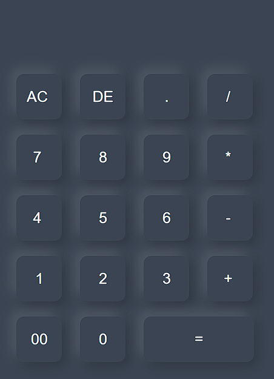

<p>
  <h1 align="center">
    <b>
  Calculator       <!--The title for my project.--> 
    </b>
  </h1>
</p> 

<h2 align="left">
     <b>
         <a href="https://github.com/himeshx/Calculator">
             🔰</a> Overview
     </b>
</h2>

Hello! 👋
My name is <a href="https://github.com/himeshx">```Himesh Mohapatra```</a> 
This GitHub project showcases an interactive web calculator designed and implemented using HTML, CSS, and JavaScript. The calculator provides a user-friendly interface for performing basic arithmetic operations such as addition, subtraction, multiplication, and division. It also includes features like a clear button to reset the input. 

- My GitHub profile: <a href="https://github.com/himeshx">```Github!```</a>
- My Linkedin profile: <a href="https://www.linkedin.com/in/himesh-mohapatra-386aa8224/">```Linkedin!```</a>
----
<h2 align="left">
    <b>
            🏹</a> Tech Stack (Frontend+Backend)
    </b>
</h2>

- JavaScript 
- HTML 
- CSS
  
----
<h2 align="left">
  <b>
    ©️ Copyright Disclaimer
  </b>
</h2>

- Under section 107 of the Copyright Act 1976, allowance is made for "fair use" for purposes such as criticism, comment, teaching, education, scholarship and research. Fair use is a use permitted by the copyright statute that might otherwise be infringing. Non-profit, educational or personal use tips the balance in favour of fair use.   
----
<div align="center">
    
</div>

